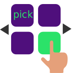
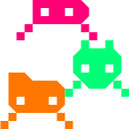
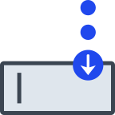
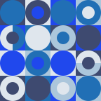
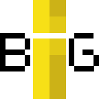
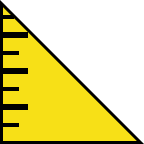

## Projects
 crece <a href="#">link</a> 
 bosque <a href="#">link</a> 
 block <a href="#">link</a> 
 books <a href="#">link</a> 
 bosque <a href="#">link</a> 
 bot <a href="#">link</a> 
 catalogue <a href="#">link</a> 
 pokedex <a href="https://github.com/patricio-dsgn/js-pokedex/">link</a> 

## Demos
 explore <a href="#">link</a> 
 md <a href="#">link</a> 
 play <a href="#">link</a> 
 source invaders <a href="https://github.com/patricio-dsgn/source-invaders/">link</a> 

## Experimental

### css 
 img-full <a href="#">link</a> 
 inputs <a href="#">link</a> 
 keyframes <a href="#">link</a> 
 pattern <a href="#">link</a> 
 bootstrap-patch <a href="#">link</a> 
 responsive <a href="https://github.com/patricio-dsgn/css-responsive/">link</a> 
 text-bg <a href="#">link</a> 

### html 
 responsive-img <a href="#">link</a> 

### js 
 animations-flash <a href="#">link</a> 
 big-text <a href="https://github.com/patricio-dsgn/js-big-text/">link</a> 
 lazyloading <a href="#">link</a> 
 parallax <a href="#">link</a> 
 post-it <a href="https://github.com/patricio-dsgn/js-post-it/">link</a> 
 ruler <a href="#">link</a> 
 tooltip <a href="#">link</a> 

 python-dalecolor  <a href="https://github.com/patricio-dsgn/python-dalecolor/">link</a> 
 js-php-forms  <a href="https://github.com/patricio-dsgn/js-php-postalservice/">link</a> 
 js-php-forms  <a href="#">link</a> 

