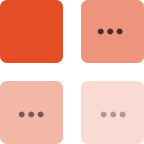

🦊 🚀 💭 👾 
# patricio-dsgn
**Designer & Developer**

*UXUI, Industrial Design, Python, JavaScript*

---

- Fullstack Python, JavaScript and UX/UI Design
- Multimedia and audiovisual development
- Strategic and creative design (Design Thinking)
- Educational Design (Learning eXperience Design - LXD)

##  Development

 
<a href="https://github.com/patricio-dsgn/html-responsiveimg/"> html-responsiveimg</a> 
<a href="https://github.com/patricio-dsgn/html-lazyloading/"> html-lazyloading</a> 

 
<a href="https://github.com/patricio-dsgn/css-bootstrapfix/"> css-bootstrapfix</a> 
<a href="https://github.com/patricio-dsgn/css-imgfull/"> css-imgfull</a> 
<a href="https://github.com/patricio-dsgn/css-inputs/"> css-inputs</a> 
<a href="https://github.com/patricio-dsgn/css-keyframes/"> css-keyframes</a> 
<a href="https://github.com/patricio-dsgn/css-pattern/"> css-pattern</a> 
<a href="https://github.com/patricio-dsgn/css-responsive/"> css-responsive</a> 
<a href="https://github.com/patricio-dsgn/css-textbg/"> css-textbg</a> 

 
<a href="https://github.com/patricio-dsgn/js-keycodes/"> js-keycodes</a> 
<a href="https://github.com/patricio-dsgn/js-async/"> js-async</a> 
<a href="https://github.com/patricio-dsgn/js-dalecolor/"> js-dalecolor</a> 
<a href="https://github.com/patricio-dsgn/js-method/"> js-method</a> 
<a href="https://github.com/patricio-dsgn/js-parallax/"> js-parallax</a> 
<a href="https://github.com/patricio-dsgn/js-postit/"> js-postit</a> 
<a href="https://github.com/patricio-dsgn/js-ruler/"> js-ruler</a> 
<a href="https://github.com/patricio-dsgn/js-tooltip/"> js-tooltip</a> 
 
 
<a href="https://github.com/patricio-dsgn/lab-animationsflash/"> lab-animationsflash</a> 
<a href="https://github.com/patricio-dsgn/lab-cambiaforma/"> lab-cambiaforma</a> 
<a href="https://github.com/patricio-dsgn/lab-kaleidoscope/"> lab-kaleidoscope</a> 
<a href="https://github.com/patricio-dsgn/lab-getjson/"> lab-getjson</a> 
<a href="https://github.com/patricio-dsgn/lab-whatsapp/"> lab-whatsapp</a> 
